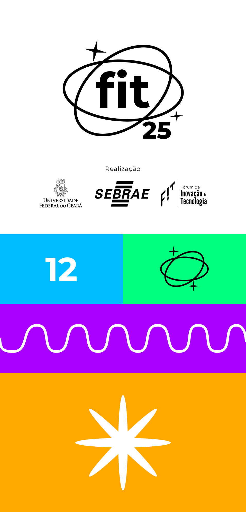

# FIT 2025 — Internet das Coisas e suas aplicações



Este repositório contém o código-fonte do site oficial do **FIT 2025**, o maior evento universitário de tecnologia do Sertão de Crateús. Com o tema "Internet das Coisas e suas Aplicações", o site foi desenvolvido para ser o principal ponto de contato e informação para participantes, palestrantes e patrocinadores.

## 📋 Índice

*   ✨ Sobre o Projeto
*   🚀 Funcionalidades
*   🛠️ Tecnologias Utilizadas
*   ⚙️ Como Executar
*   🎨 Personalização
*   🙏 Créditos
*   📄 Licença

## ✨ Sobre o Projeto

O site do FIT 2025 foi desenvolvido para ser o principal ponto de contato e informação para os participantes, palestrantes e patrocinadores. Ele apresenta um design moderno, responsivo e interativo, construído com tecnologias web de ponta para garantir uma experiência de usuário fluida e agradável.

## 🚀 Funcionalidades

*   **🎨 Design Moderno e Responsivo:** Interface construída com **Tailwind CSS** que se adapta perfeitamente a desktops, tablets e smartphones.
*   **🖼️ Galeria de Imagens Avançada:**
    *   Carregamento dinâmico de imagens a partir de pastas do **Google Drive**.
    *   Mecanismo de **fallback** para exibir imagens locais caso a API falhe.
    *   Slideshow principal, grid de miniaturas e um modal com todas as fotos.
    *   Filtros por categoria (Geral, Minicursos) e **paginação** no modal.
    *   Funcionalidade de **lightbox** para ampliar e baixar imagens individualmente.
*   **🛡️ Proteção de Código:** Scripts para desabilitar o clique direito, a tecla F12 e atalhos de desenvolvedor (`Ctrl+U`, `Ctrl+Shift+I`), desencorajando a inspeção casual do código.
*   **📅 Programação Dinâmica:** A agenda do evento pode ser carregada a partir de um arquivo `JSON`, facilitando atualizações.
*   **⚙️ Otimizações e SEO:** Boas práticas de SEO, meta tags (Open Graph, Schema.org), semântica HTML e `loading="lazy"` para otimizar o carregamento de imagens.

## 🛠️ Tecnologias Utilizadas

O projeto foi construído utilizando as seguintes tecnologias:

*   **HTML5:** Estrutura semântica do site.
*   **Tailwind CSS:** Framework CSS para estilização rápida e responsiva.
*   **JavaScript (Vanilla):** Interatividade, manipulação do DOM, consumo da API do Google Drive e lógica da aplicação.
*   **Font Awesome:** Biblioteca de ícones.
*   **Google Fonts:** Fonte Montserrat para a tipografia.

## ⚙️ Como Executar

Para visualizar e interagir com o projeto localmente, siga os passos abaixo:

1.  **Clone o repositório:**
    ```bash
    git clone https://github.com/fit-crateus/fit-2025.git
    ```
2.  **Navegue até o diretório do projeto:**
    ```bash
    cd fit-2025
    ```
3.  **Inicie um servidor local:**
    Como o projeto utiliza a API `fetch()` para carregar imagens da galeria, ele precisa ser servido por um servidor web para evitar erros de CORS. Uma maneira fácil é usar a extensão **Live Server** no VS Code.
    *   Instale a extensão.
    *   Clique com o botão direito no arquivo `index.html` e selecione "Open with Live Server".

## 🎨 Personalização

*   **Imagens da Galeria:** As imagens são carregadas do Google Drive. Para usar suas próprias pastas, modifique as constantes `FOTOS_GERAIS_IDS` e `MINICURSOS_FOTOS_IDS` no script no final do arquivo `index.html`.
*   **Chave da API:** **Atenção!** A chave da API do Google Drive (`DRIVE_API_KEY`) está exposta no código. Para um ambiente de produção real, é crucial protegê-la usando um backend ou funções serverless.
*   **Estilos:** Ajustes visuais podem ser feitos diretamente com classes do Tailwind CSS no HTML ou adicionando CSS customizado em `assets/css/style.css`.

## 🙏 Créditos

*   **Organização FIT 2025** — UFC Crateús
*   Todos os **patrocinadores e apoiadores** que tornaram o evento possível.
*   **Desenvolvimento Web:** Vicente Neto, Paula Laiz, Francisca Maria.

## 📄 Licença

Este projeto é de uso institucional e educacional, representando o site oficial do evento FIT 2025.

----
Dúvidas? Entre em contato pelo e-mail: `fit@crateus.ufc.br`